<h1 align="center">Hey  I'm Jeevan Naik</h1>
<h3 align="center">Software Engineer</h3>

  

## 📌 About Me
- 🎓 B.E. in Computer Science & Engineering — MITE Mangalore (2025)
- 💼 Full Stack Developer at Inferentics, building EdTech backend systems & APIs
- 🌱 Currently learning distributed systems & scalable backend architecture
- ⚡ Passionate about building real-world impact through clean, scalable code
- 📍 Based in Kumta, Uttar Kannada, Karnataka

## 🧠 My Focus Areas
- Full Stack Web Development
- Backend & API Engineering
- Cloud Infrastructure & DevOps
- AI/ML Integration
- AI-Augmented Software Development

## 📊 GitHub Stats & Trophies

  

  

  

## 🛠️ Languages & Tools

<h3 align="center">Programming Languages</h3>

  &nbsp;&nbsp;&nbsp;
  &nbsp;&nbsp;&nbsp;
  &nbsp;&nbsp;&nbsp;
  &nbsp;&nbsp;&nbsp;
  

<h3 align="center">Frontend</h3>

  &nbsp;&nbsp;&nbsp;
  &nbsp;&nbsp;&nbsp;
  &nbsp;&nbsp;&nbsp;
  &nbsp;&nbsp;&nbsp;
  &nbsp;&nbsp;&nbsp;
  

<h3 align="center">Backend</h3>

  &nbsp;&nbsp;&nbsp;
  &nbsp;&nbsp;&nbsp;
  &nbsp;&nbsp;&nbsp;
  

<h3 align="center">Database</h3>

  &nbsp;&nbsp;&nbsp;
  &nbsp;&nbsp;&nbsp;
  

<h3 align="center">DevOps & Cloud</h3>

  &nbsp;&nbsp;&nbsp;
  

<h3 align="center">Tools</h3>

  &nbsp;&nbsp;&nbsp;
  &nbsp;&nbsp;&nbsp;
  &nbsp;&nbsp;&nbsp;
  &nbsp;&nbsp;&nbsp;
  &nbsp;&nbsp;&nbsp;
  

  

 

## 🔗 Connect with Me

  &nbsp;&nbsp;
  &nbsp;&nbsp;
  &nbsp;&nbsp;
  

## 💬 Quote
> Building things that matter

  

